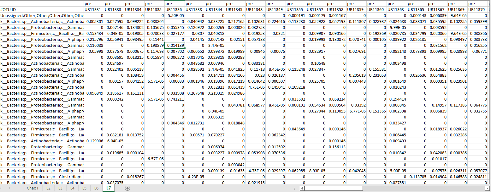
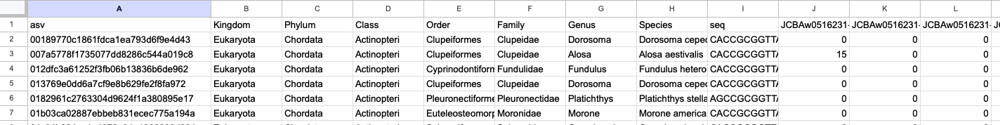

# unh-edna-pipelines for UNH MBON
Code for eDNA metabarcoding on RON and Premise @UNH

### Qiime workflow
[MBON Workflow for MiFish](sh/MBON_Workflow.sh)  
We process the sequcenced eDNA samples with Qiime2. Qimme2 has plugins for adapter/primer trimming (cutadapt) and denoising ASVs (dada2). This step generates a table of ASVs (allele sequence variants, or the total unique sequences occuring among all of the samples) and the count that the seqence appears in each of the samples. 

##### Provide an ASV table here

### Classifying ASVs
Each of the ASVs (or features) are then classified in Qiime by:  
1) providing a reference database of sequences and a corresponding taxonomy
2) Selecting one of Qiime's 'feature-classifier' algorithms  

### Refernce database info  
For all Mifish primers, we use [Mitofish](https://mitofish.aori.u-tokyo.ac.jp/download/). Custom/currated reference databases can also be generated by downloading sequences and annotations from a number of different sources. (SILVA, NCBI/genbank, BOLD, ect.)

### feature-classifier info  
We use qiime's 'classify-hybrid-vsearch-sklearn'. This classifier is a hybrid of the VSEARCH algorithm (similar to BLAST) for exact matches, and uses sci-kit learn classifier that has been trained to classify reference database sequeces (in this case, the MiFish reference database above). We find that the hybrid approach may be more robust to hard cuttoff parameters of BLAST/VSEARCH alone. 

## Post-processing of ASV classifications
For a number of reasons (such as choice of cutoff parameters, reference database incompleteness, and variable rates of substititions along phylogenetic trees) sequence classifiers often arrive at the wrong or incomplete taxonomy. In the case of MiFish, the number of species identified among the samples are short- so individuals often forced to correct the classifications by hand using the known distributions of fish (such as Fishbase or others). 

### Our approach:  
In efforts to standardize this approach, we have tried using observations from GBIF from sample locations to systematically annotate each of the ASV classifications in a similar way to the 'by hand' approach above. At GBIF, users can draw polygons on a map to download a huge number of local fish occurances.  

For incomplete classifications: For example, if an ASV is annotated only to the genus level, we can query the GBIF occurances in the area to return all the species that match the genus. If there is only one species of the genus in that area, we might update the classification to this species.

For incorrect classifications:

### Steps to cross reference of GBIF for each classification
1. Download GBIF occurances for all fish near eDNA samples locations
    - Navigate to GBIF web interface  
2. Filter obervations to those species that occured more than 3 times (after plotting the data, I found that this reduces the size of the file substantially and likely cuts down on spurious species observations)  
    - Filter using fish taxonomy (use familes to pull out all fish)
        - Note: I need to add the list of fish families that I used.
2. Make a summary table for the number of times each species had occured in map area
3. 

Instructions for submitting request via GBIF API
- [json](https://techdocs.gbif.org/en/data-use/api-downloads.html)

Output for each classification:
- Does the species occur in map area?  
    - If no, are there any fish in the same genus? Family? (similar result if classified only to the genus level)  
    - Note: I could use a refrence database tree to report closest relative and within map area ? 
- For classifications to the genus level or higher: if few species share 

Filter GBIF obervations to fish only
    - Note: 
    - Cross reference GBIF table with input reference database

### Example outputs:    
BIOM Format  
  

Custom ASV output format  
  