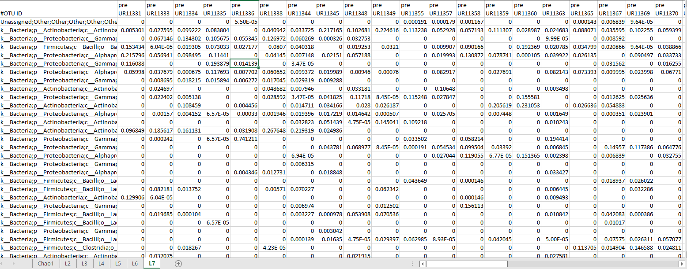
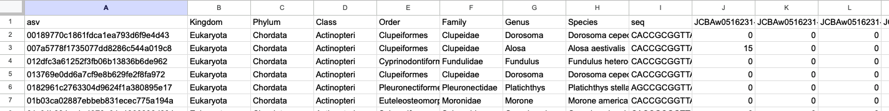

# unh-edna-pipelines for UNH MBON
Code for eDNA metabarcoding on RON and Premise @UNH

### Qiime workflow
[MBON Workflow for MiFish](sh/MBON_Workflow.sh)  
We process the sequcenced eDNA samples with Qiime2. Qimme2 has plugins for adapter/primer trimming (cutadapt) and denoising ASVs (dada2). This step generates a table of ASVs (allele sequence variants, or the total unique sequences occuring among all of the samples) and the count that the seqence appears in each of the samples. 

##### Provide an ASV table here

### Classifying ASVs
Each of the ASVs (or features) are then classified in Qiime by:  
1) providing a reference database of sequences and a corresponding taxonomy
2) Selecting one of Qiime's 'feature-classifier' algorithms  

### Refernce database info  
For all Mifish primers, we use [Mitofish](https://mitofish.aori.u-tokyo.ac.jp/download/). Custom/currated reference databases can also be generated by downloading sequences and annotations from a number of different sources. (SILVA, NCBI/genbank, BOLD, ect.)

### feature-classifier info  
We use qiime's 'classify-hybrid-vsearch-sklearn'. This classifier is a hybrid of the VSEARCH algorithm (similar to BLAST) for exact matches, and uses sci-kit learn classifier that has been trained to classify reference database sequeces (in this case, the MiFish reference database above). We find that the hybrid approach may be more robust when using some of the hard cuttoff parameters of BLAST/VSEARCH alone. 

## Our approach: Post-processing of ASV classifications
For a number of reasons (such as choice of cutoff parameters, reference database incompleteness, and variable rates of substititions along phylogenetic trees) sequence classifiers are known to be wrong or incomplete. In the case of MiFish, the number of species identified among the samples are often short- so the classification results are often corrected 'by hand', or annotated, using the known distributions of fish (such as Fishbase or other sources). 

In efforts to make these 'by hand' corrections more reproducible, we have started using GBIF observations around eDNA sample locations to systematically annotate/correct each of the ASV classifications. To accomplish this, the user downloads a huge number of species observations from the GBIF web interface by drawing polygons on a map around the sample locations. Then, the GBIF occurances are further filtered to the taxonomic groups that would be expected to be captured by the primer used for the samples (ex: filter out non-fish if using the mifish primer). Bash code [here](gbif/gbif-crossref.sh)

### Corrections/Annotation 
R code [here](gbif/gbif-crossref.R)

For incorrect classifications: We check a GBIF database for each ASV's classification. If the genus and species name has no observations records in the area, the script returns nothing. For species that do, the output column contains 'MATCH'. For incomplete classifications: For example, if an ASV is annotated only to the genus level, we can query the GBIF occurances in the area to return all the species that match the genus. Genus level classifications would not match anything in the fish list, so the BLAST hits are checked. If there is only one species of the genus in that area, one could argue that the ASV would be classified as this species if it did. For ASVs that do not match, we use BLAST to suggest local classifications. See BLAST + GBIF section below.

### Steps to cross reference of GBIF for each classification
1. Download GBIF occurances for all fish near eDNA samples locations
    - Navigate to GBIF web interface
    - Draw a polygon around the sample locations to filter to local GBIF observations. Note: GBIF generates a citeable DOI for each data download. Make an account with GBIF to return this DOI later, and to store the GPS coordinantes of the polygon that you used
2. Filter local obervations to those species that occured more than 3 times or more 
    - After plotting the data, I found that this reduces the size of the file substantially and likely cuts down on spurious species observations
3. Filter using fish taxonomy (use familes to pull out all fish)
    - Note: I needed to find this externally, as gbif doesn't allow you to select 'fish only' obersvations. Humans, after all, are just land-dwelling fish.
     (to do: add the list of fish families that I used.)
    - Make a summary table for the number of times each species had occured in map area
        - This can be useful for reference later

Alternative to this 'local fish list' approach, GBIF data can be queried programatically for each species with their API. Instructions for submitting request via GBIF API:
- [json](https://techdocs.gbif.org/en/data-use/api-downloads.html)

Output for each classification:
- Does the species occur in map area?  
    - If no, are there any fish in the same genus? Family? (similar result if classified only to the genus level)  
    - Note: I could use a refrence database tree to report closest relative and within map area ? 
- For classifications to the genus level or higher: if few species share 

### BLAST + GBIF to provide alternative classifications 
For ASVs that were classified to the genus level or higher or classified to a species that does not fall in the GBIF area, we BLAST ASVs to the full database to suggest alternative classifications. In addition, the classification of MiFish ASVs with the currated mitofish reference database is consistent for the classification of fish only. Off-target amplicons are common and may be of interest as well. Returning the top BLAST hits can be helpful to identify contaminants and other off-target taxa (such as humas) that are amplified with this the Mifish primers.  

Output tables:
Qiime_in_GBIF - Returns MATCH if the sklearn-hybrid classification of species name is in the GBIF fish list

BLAST_in_GBIF - Returns MATCH if any of the top blast hits are in the GBIF fish list

BLAST_GBIF_GUESS - Returns the species name of the MATCH from BLAST_in_GBIF 

scomnames - BLAST output, common name of the top blast hit(s)	

sscinames - BLAST output, scientific name of the top blast hit(s) that is used to check the GBIF fish list

sskingdoms - Kingdom of top BLAST hit. Good for removing bacteria

evalue - e-value of the top blast hits(s). 

pident - Percent identity the ASV shares with the BLAST alignment 

seq - The sequence of the ASV with the primer sequences removed

### Example outputs:    
BIOM Format  
  

Custom ASV output format  
  

### Mannual Annotation Process
Manual Blast - Review 5 first blast matches, if they match QIIME, col. indicates confirmed. If not, list any species of top 5 that is 99% PID 

